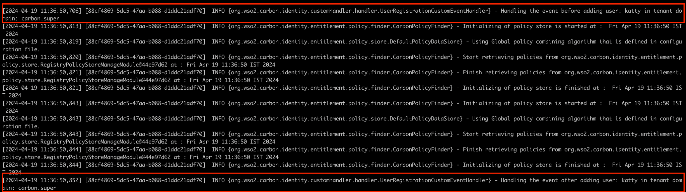

# Introduction

WSO2 Identity Server supports the eventing framework, which can be used
to trigger some events such as user operations. Also, the eventing
framework supports handlers that can be used to do some operations based
on the published events.

Ex:

- PRE_AUTHENTICATION

- POST_AUTHENTICATION

- PRE_SET_USER_CLAIMS

- POST_SET_USER_CLAIMS

- PRE_ADD_USER

- POST_ADD_USER

- PRE_UPDATE_CREDENTIAL … etc

To demonstrate this, we are going to **print the event properties in the
console after a user addition**. The following sequence of operations
are executed while adding a user.

1.  Publish the **PRE_ADD_USER** event

    - The subscribed handlers will be executed for the pre-add user
      event.

2.  Execute the **AddUser** operation.

    - The user will be persisted in the user store (LDAP or JDBC).

3.  Publish the **POST_ADD_USER** event

    - The subscribed handlers will be executed for the post-add user
      event.

Therefore, we can perform our task through an event handler, which is
subscribed to the POST_ADD_USER event.

# Write an event handler

Follow the steps given below to write the handler.

1.  To write a new event handler, you must extend
    org.wso2.carbon.identity.event.handler.AbstractEventHandler.

<table style="width:92%;">
<colgroup>
<col style="width: 92%" />
</colgroup>
<thead>
<tr>
<th style="text-align: left;">
package
org.wso2.carbon.identity.customhandler.handler;

public class UserRegistrationCustomEventHandler extends
AbstractEventHandler {
</th>
</tr>
</thead>
<tbody>
</tbody>
</table>

2.  Override the getName() method to set the name for the event handler
    and the getPriority() method can be used to set the priority of the
    event handler.\
    \
    The handlers will be executed based on priority.

<table style="width:92%;">
<colgroup>
<col style="width: 92%" />
</colgroup>
<thead>
<tr>
<th style="text-align: left;">
public String getName() {

return "customUserRegistration";

}

public int getPriority(MessageContext messageContext) {

return 250;

}
</th>
</tr>
</thead>
<tbody>
</tbody>
</table>

3.  The handleEvent() method can be used to do the actual operation. The
    parameters related to the user operations can be taken from the
    event.getEventProperties() method.

<table style="width:92%;">
<colgroup>
<col style="width: 92%" />
</colgroup>
<thead>
<tr>
<th>
public void handleEvent(Event event) {

if
(IdentityEventConstants.Event.PRE_ADD_USER.equals(event.getEventName()))
{

String tenantDomain = (String) event.getEventProperties().get(

IdentityEventConstants.EventProperty.TENANT_DOMAIN);

String username = (String) event.getEventProperties().get(

IdentityEventConstants.EventProperty.USER_NAME);

log.info("Handling the event before adding user: " + username

+ " in tenant domain: " + tenantDomain);

<strong>// You can write any code here to handle the
event.</strong>

}

if
(IdentityEventConstants.Event.POST_ADD_USER.equals(event.getEventName()))
{

String tenantDomain = (String) event.getEventProperties()

.get(IdentityEventConstants.EventProperty.TENANT_DOMAIN);

String userName = (String) event.getEventProperties().get(

IdentityEventConstants.EventProperty.USER_NAME);

log.info("Handling the event after adding user: " + userName

+ " in tenant domain: " + tenantDomain);

<strong>// You can write any code here to handle the
event.</strong>

}

}
</th>
</tr>
</thead>
<tbody>
</tbody>
</table>

4.  Register the event handler.\
    \
    The event handler needs to register in the service component as
    follows.

<table style="width:92%;">
<colgroup>
<col style="width: 92%" />
</colgroup>
<thead>
<tr>
<th>
package org.wso2.carbon.identity.customhandler.internal;

@Component(

name = "org.wso2.carbon.identity.customhandler.internal

.UserRegistrationCustomEventHandlerComponent",

immediate = true

)

public class UserRegistrationCustomEventHandlerComponent {

private static Log log = LogFactory.getLog(

UserRegistrationCustomEventHandlerComponent.class);

protected void activate(ComponentContext context) {

try {

BundleContext bundleContext = context.getBundleContext();

bundleContext.registerService(AbstractEventHandler.class.getName(),

new UserRegistrationCustomEventHandler(), null);

} catch (Exception e) {

log.error("Error while activating custom User selfRegistration
handler”

+ “component.", e);

}

}
</th>
</tr>
</thead>
<tbody>
</tbody>
</table>

# Prerequisites

1.  A [<u>WSO2 Identity Server</u>](https://wso2.com/identity-server/)
    setup.

- Please verify that all the [<u>system
  requirements</u>](https://is.docs.wso2.com/en/latest/deploy/environment-compatibility/)
  are satisfied.

2.  An Application registered in Identity Server.

3.  An application deployed in Tomcat server.

> Ex:
> [<u>pickup-dispatch</u>](https://github.com/wso2/samples-is/releases/download/v4.6.3/pickup-dispatch.war)
> application

4.  Enable self Registration in IS

    1.  In the WSO2 Identity Server **Console,** from the menu go to
        **Login & Registration** \> **User Onboarding \> Self
        Registration** section**.**

    2.  Click on the Toggle to **Enable**.

5.  [<u>Configure the email sending
    module</u>](https://is.docs.wso2.com/en/latest/deploy/configure/email-sending-module/)
    with WSO2 Identity Server.

# Set up

We have implemented a sample custom event handler for you. You can
access that from
[<u>here</u>](https://github.com/wso2/samples-is/tree/master/event-handler/custom-identity-event-handler).
Follow the below instructions after cloning the
[<u>sample-is</u>](https://github.com/wso2/samples-is) repo into your
local machine.

1.  Navigate to the event-handler/custom-event-handler directory.

| cd event-handler/custom-identity-event-handler |
|------------------------------------------------|

2.  Run the following command:

| mvn clean install |
|-------------------|

3.  Copy the generated jar file in the target folder into the
    \<IS_HOME\>/repository/components/dropins/ folder.

4.  To configure the event handler, add the event handler configuration
    to the \<IS_HOME\>/repository/conf/deployment.toml file.\
    \
    The events that need to subscribe to the handler can be listed in
    subscriptions.

<table style="width:92%;">
<colgroup>
<col style="width: 92%" />
</colgroup>
<thead>
<tr>
<th style="text-align: left;">
[[event_handler]]

name= "customUserRegistration"

subscriptions = ["PRE_ADD_USER","POST_ADD_USER"]
</th>
</tr>
</thead>
<tbody>
</tbody>
</table>

5.  Navigate to \<IS_HOME\>/bin and start the server by issuing one of
    the following commands based on your operating system:

    - For Linux:

| ./wso2server.sh |
|-----------------|

- For Windows:

| ./wso2server.bat run |
|----------------------|

# Try it

1.  Go to
    [<u>http://localhost.com:8080/pickup-dispatch</u>](http://localhost.com:8080/pickup-dispatch)
    and click **Register**.

2.  You will get redirected to the self-registration page of WSO2
    Identity Server.

3.  Add details of the user that need to be onboarded.

4.  After onboarding the user, check the IS server logs. You should see
    the logs below.

