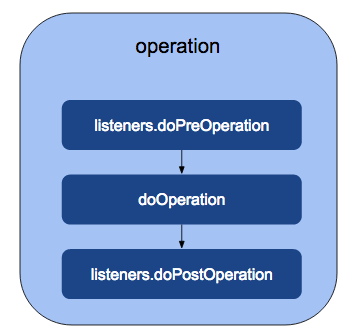

# Introduction

WSO2 Carbon user stores provide the ability to customize user store
operations by registering an event listener for these operations. The
listeners are executed at a fixed point in the user store operation, and
the users are free to create a listener that implements their desired
logic to be executed at these fixed points. A listener is an extension
to extend the user's core functions. Any number of listeners can be
plugged into the user core and they would be called one by one. By using
a listener, you are not overriding the user store implementation, which
is good since you are not customizing the existing implementations.

The above diagram demonstrates a typical flow of execution of the user
store operation, along with the listener's methods.

The flow is as follows.

1.  Initially, the operation method (here, representative of any user
    store operation) calls the listener.doPreOperation, which is
    implemented in the listener.

2.  Then, the doOperation method is called, which is implemented in the
    subclass by extending
    org.wso2.carbon.user.core.common.AbstractUserStoreManager, the
    abstract class that implements the UserStoreManager interface.

3.  Finally, the listener.doPostOperation method is called.

## How listeners work

Whenever the user core method is called, all the listeners that are
registered with that method are called. Listeners can be registered
before or after the actual method is called.

# Sample scenario

When a user is authenticated with an LDAP, assume that it is a
requirement to add the authenticated time as a user attribute. To
fulfill this requirement, you need to write some custom code to be
executed after successful user authentication. The following is the
custom listener implementation for this. The doPostAuthenticate() method
would be called after actual user authentication is done.

# Write a custom listener

Follow the steps given below to write a custom user store listener.
Please note that there are high level instructions on what you need to
follow to add a custom listener. A complete implementation blueprint can
be found
[<u>here</u>](https://github.com/wso2/samples-is/tree/f960b6b648a9b7f5fd2aa89fc6d7dbc74ceb1e60/user-mgt/custom-user-store-listener).

1.  To write a new listener, you must extend
    org.wso2.carbon.user.core.common.AbstractUserOperationEventListener.

<table style="width:92%;">
<colgroup>
<col style="width: 92%" />
</colgroup>
<thead>
<tr>
<th style="text-align: left;">
package
org.wso2.custom.user.store.listener;

public class MyCustomUserStoreListener extend
AbstractUserOperationEventListener {
</th>
</tr>
</thead>
<tbody>
</tbody>
</table>

2.  Override the getExecutionOrderId() method to return any random
    value.\
    \
    This is important when there is more than one listener in WSO2 IS
    and you need to consider their execution order. All the methods
    return a boolean value. This value is mentioned regardless of
    whether you want to execute the next listener or not.

<table style="width:92%;">
<colgroup>
<col style="width: 92%" />
</colgroup>
<thead>
<tr>
<th>
@Override

public int getExecutionOrderId() {

return 9883;

}
</th>
</tr>
</thead>
<tbody>
</tbody>
</table>

3.  Override doPostAuthenticate() method. This method would be called
    after actual user authentication is done. For now let’s add some
    logs to test if the implementation works as expected. Later on you
    can custom logic according to your requirement.

<table style="width:92%;">
<colgroup>
<col style="width: 92%" />
</colgroup>
<thead>
<tr>
<th>
@Override

public boolean doPostAuthenticate(String userName, boolean
authenticated, UserStoreManager userStoreManager) throws
UserStoreException {

<strong>// custom logic</strong>

// check whether the user is authenticated

if(authenticated){

log.info("=== doPostAuthenticate ===");

log.info("User " + userName + " logged in at " +
System.currentTimeMillis());

log.info("=== /doPostAuthenticate ===");

}

return true;

}
</th>
</tr>
</thead>
<tbody>
</tbody>
</table>

4.  Register the event handler.

> The event handler needs to register in the service component as
> follows:

<table style="width:92%;">
<colgroup>
<col style="width: 92%" />
</colgroup>
<thead>
<tr>
<th>
Package org.wso2.custom.user.store.listener.internal;

@Component(name = "custom.user.store.listener.component",

immediate = true)

public class CustomExtensionServiceComponent {

private static final Log log =
LogFactory.getLog(CustomExtensionServiceComponent

.class);

protected void activate(ComponentContext context) {

MyUserStoreCustomListener listener = new
MyUserStoreCustomListener();

context.getBundleContext().registerService(UserOperationEventListener

.class.getName(), listener, null);

log.debug("My Custom bundle is activated");

}
</th>
</tr>
</thead>
<tbody>
</tbody>
</table>

# Prerequisite

1.  A [<u>Wso2 Identity Server</u>](https://wso2.com/identity-server/)
    setup.

- Please verify that all the [<u>system
  requirements</u>](https://is.docs.wso2.com/en/latest/deploy/environment-compatibility/)
  are satisfied.

2.  An Application registered in Identity Server.

3.  An application deployed in Tomcat server.

> Ex:
> [<u>pickup-dispatch</u>](https://github.com/wso2/samples-is/releases/download/v4.6.3/pickup-dispatch.war)
> application

# Set up

The existing implementation of a custom user store listener can be
downloaded from
[<u>here</u>](https://github.com/wso2/samples-is/tree/f960b6b648a9b7f5fd2aa89fc6d7dbc74ceb1e60/user-mgt/custom-user-store-listener).

1.  Listeners are registered as OSGi components. Therefore you need to
    register this class in an OSGi framework. Implementation details can
    be found
    [<u>here</u>](https://github.com/wso2/samples-is/tree/master/user-mgt/custom-user-store-listener).

2.  Clone [<u>wso2/samples-is</u>](https://github.com/wso2/samples-is)
    repository and navigate to user-mgt/custom-user-store-listener
    directory.

| cd event-handler/custom-identity-event-handler |
|------------------------------------------------|

3.  Run the following command:

| mvn clean install |
|-------------------|

4.  Copy the generated jar file into the
    \<IS_HOME\>/repository/components/dropins directory.

5.  Restart the server.

# Try it

1.  Go to the homepage of the registered application.

> ex:
> [<u>http://localhost.com:8080/pickup-dispatch</u>](http://localhost.com:8080/pickup-dispatch)

2.  You will be redirected to the authentication portal as shown below.
    Add user credentials.

3.  After a successful authentication, the below logs can be found in
    the IS server logs.

>  src="images/image3.png"
> style="width:6.5in;height:0.69444in" />
