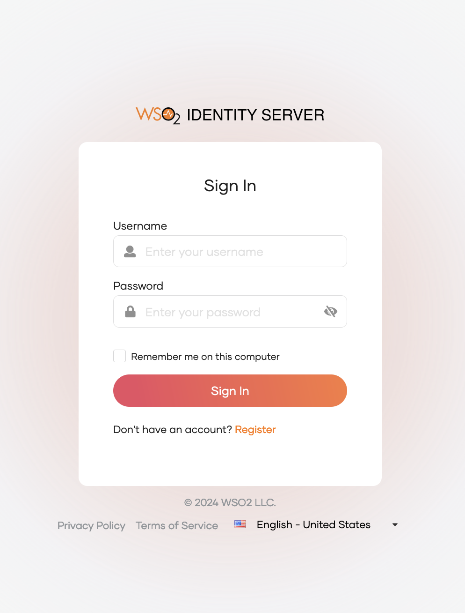
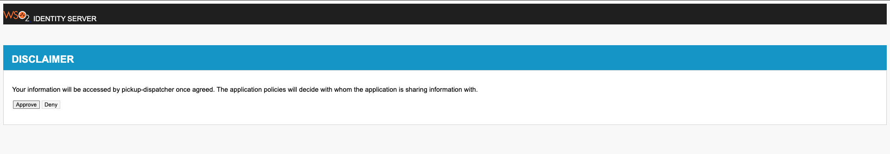

# Introduction

WSO2 Identity Server authentication framework facilitates you with the
pluggable architecture of multiple inbound/outbound protocols as well as
local and federated authenticators including a large number of extension
points. The Post Authentication Handler is one such extension point
which allows you to do a task upon successful authentication.
Authentication to the system is only successful once the execution of
post-authentication handlers is completed.

To demonstrate this, we will implement a post authenticator which will
request your consent for retrieving user information from WSO2 IS to the
service provider, upon successfully passing the authentication steps.
The behavior of this post-authentication handler is,

1.  A consent page will be popped up upon successfully passing the
    authentication steps.

2.  If you click on approve, then you will be redirected to your
    application with a successful login

3.  If you deny the consent, authentication will be failed and you will
    be shown an error message on the screen.

# Write an event handler

Follow the steps given below to write the handler.

1.  To write a new event handler, you must extend
    org.wso2.carbon.identity.application.authentication.framework.handler.request.AbstractPostAuthnHandler.

<table style="width:92%;">
<colgroup>
<col style="width: 92%" />
</colgroup>
<thead>
<tr>
<th>
package
org.wso2.carbon.identity.custom.post.authn.handler.disclaimer;

public class CRDBTrainingCustomPostAuthenticationHandler extends
AbstractPostAuthnHandler {
</th>
</tr>
</thead>
<tbody>
</tbody>
</table>

2.  Override the following methods accordingly:

<table style="width:92%;">
<colgroup>
<col style="width: 92%" />
</colgroup>
<thead>
<tr>
<th>
private String CONSENT_POPPED_UP = "consentPoppedUp";

@Override

public PostAuthnHandlerFlowStatus handle(HttpServletRequest
httpServletRequest,

HttpServletResponse httpServletResponse,

AuthenticationContext authenticationContext)

throws PostAuthenticationFailedException {

if (getAuthenticatedUser(authenticationContext) == null) {

return PostAuthnHandlerFlowStatus.SUCCESS_COMPLETED;

}

if (isConsentPoppedUp(authenticationContext)) {

if
(httpServletRequest.getParameter("consent").equalsIgnoreCase("approve"))
{

return PostAuthnHandlerFlowStatus.SUCCESS_COMPLETED;

} else {

throw new PostAuthenticationFailedException("Cannot access this
application : Consent Denied",

"Consent denied");

}

} else {

try {

httpServletResponse.sendRedirect

(ConfigurationFacade.getInstance().getAuthenticationEndpointURL().replace("/login.do",
""

) + "/disclaimer" + ".jsp?sessionDataKey=" +
authenticationContext.getContextIdentifier() +

"&amp;application=" + authenticationContext

.getSequenceConfig().getApplicationConfig().getApplicationName());

setConsentPoppedUpState(authenticationContext);

return PostAuthnHandlerFlowStatus.INCOMPLETE;

} catch (IOException e) {

throw new PostAuthenticationFailedException("Invalid Consent", "Error
while redirecting", e);

}

}

}

@Override

public String getName() {

return "DisclaimerHandler";

}

private AuthenticatedUser getAuthenticatedUser(AuthenticationContext
authenticationContext) {

AuthenticatedUser user =
authenticationContext.getSequenceConfig().getAuthenticatedUser();

return user;

}

private void setConsentPoppedUpState(AuthenticationContext
authenticationContext) {

authenticationContext.addParameter(CONSENT_POPPED_UP, true);

}

private boolean isConsentPoppedUp(AuthenticationContext
authenticationContext) {

return authenticationContext.getParameter(CONSENT_POPPED_UP) !=
null;

}
</th>
</tr>
</thead>
<tbody>
</tbody>
</table>

3.  Use handleEvent() method to do the actual operation.\
    \
    The parameters related to the user operations can be taken from the
    event.getEventProperties() method.

<table style="width:92%;">
<colgroup>
<col style="width: 92%" />
</colgroup>
<thead>
<tr>
<th>
public void handleEvent(Event event) {

if
(IdentityEventConstants.Event.PRE_ADD_USER.equals(event.getEventName()))
{

String tenantDomain = (String) event.getEventProperties().get(

IdentityEventConstants.EventProperty.TENANT_DOMAIN);

String username = (String)
event.getEventProperties().get(IdentityEventConstants.EventProperty.USER_NAME);

log.info("Handling the event before adding user: " + username + " in
tenant domain: " + tenantDomain);

// You can write any code here to handle the event.

}

if
(IdentityEventConstants.Event.POST_ADD_USER.equals(event.getEventName()))
{

String tenantDomain = (String) event.getEventProperties()

.get(IdentityEventConstants.EventProperty.TENANT_DOMAIN);

String userName = (String)
event.getEventProperties().get(IdentityEventConstants.EventProperty.USER_NAME);

log.info("Handling the event after adding user: " + userName + " in
tenant domain: " + tenantDomain);

// You can write any code here to handle the event.

}

}
</th>
</tr>
</thead>
<tbody>
</tbody>
</table>

4.  Register the event handler.\
    \
    The event handler needs to register in the service component as
    follows:

<table style="width:92%;">
<colgroup>
<col style="width: 92%" />
</colgroup>
<thead>
<tr>
<th>
package
org.wso2.carbon.identity.custom.post.authn.handler.disclaimer.internal;

public class CRDBTrainingCustomPostAuthnHandlerServiceComponent {

private static final Log log =
LogFactory.getLog(CRDBTrainingCustomPostAuthnHandlerServiceComponent.class);

@Activate

protected void activate(ComponentContext context) {

try {

CRDBTrainingCustomPostAuthenticationHandler
disclaimerPostAuthenticationHandler =

new CRDBTrainingCustomPostAuthenticationHandler();

context.getBundleContext().registerService(PostAuthenticationHandler.class.getName(),

disclaimerPostAuthenticationHandler, null);

} catch (Throwable e) {

log.error("Error while activating disclaimer post authentication
handler.", e);

}

}
</th>
</tr>
</thead>
<tbody>
</tbody>
</table>

# 

\
=

# Prerequisite

1.  A [<u>WSO2 Identity Server</u>](https://wso2.com/identity-server/)
    setup.

- Please verify that all the [<u>system
  requirements</u>](https://is.docs.wso2.com/en/latest/deploy/environment-compatibility/)
  are satisfied.

2.  An Application registered in Identity Server.

3.  An application deployed in Tomcat server.

> Ex:
> [<u>pickup-dispatch</u>](https://github.com/wso2/samples-is/releases/download/v4.6.3/pickup-dispatch.war)
> application

# Set up

The existing implementation of a post authentication handler can be
found from
[<u>here</u>](https://github.com/wso2/samples-is/tree/master/etc/sample-post-authentication-handler).

1.  Clone [<u>wso2/samples-is</u>](https://github.com/wso2/samples-is)
    repository and navigate to the
    etc/sample-post-authentication-handler directory.

| cd etc/sample-post-authentication-handler |
|-------------------------------------------|

2.  Run the following command:

| mvn clean install |
|-------------------|

3.  Copy the generated jar file into the
    \<IS_HOME\>/repository/components/dropins directory.

4.  Copy the
    [<u>disclaimer.jsp</u>](https://github.com/wso2/samples-is/blob/b8bc953a7cf48f5ed2e7f6df4e6c9e5acd276e3d/etc/sample-post-authentication-handler/src/main/resources/disclaimer.jsp)
    file inside the resources folder of [<u>this
    project</u>](https://github.com/wso2/samples-is/tree/master/etc/sample-post-authentication-handler)
    into
    \<IS_HOME\>/repository/deployment/server/webapps/authenticationendpoint/
    directory.

5.  To configure the event handler, add the event handler configuration
    to the \<IS_HOME\>/repository/conf/deployment.toml file.\
    \
    The events that need to subscribe to the handler can be listed in
    subscriptions.

<table style="width:92%;">
<colgroup>
<col style="width: 92%" />
</colgroup>
<thead>
<tr>
<th style="text-align: left;">
[[event_listener]]

id = "custom_post_auth_listener"

type =
"org.wso2.carbon.identity.core.handler.AbstractIdentityHandler"

name =
"org.wso2.carbon.identity.post.authn.handler.disclaimer.CRDBTrainingCustomPostAuthenticationHandler"

order = 899
</th>
</tr>
</thead>
<tbody>
</tbody>
</table>

6.  Restart the Identity Server.

\
=

# Try it

1.  Go to
    [<u>http://localhost.com:8080/pickup-dispatch</u>](http://localhost.com:8080/pickup-dispatch)
    and add your user credentials and **Sign In**.

2.  Upon successful authentication, you will be prompted to a consent
    page giving the below message.
