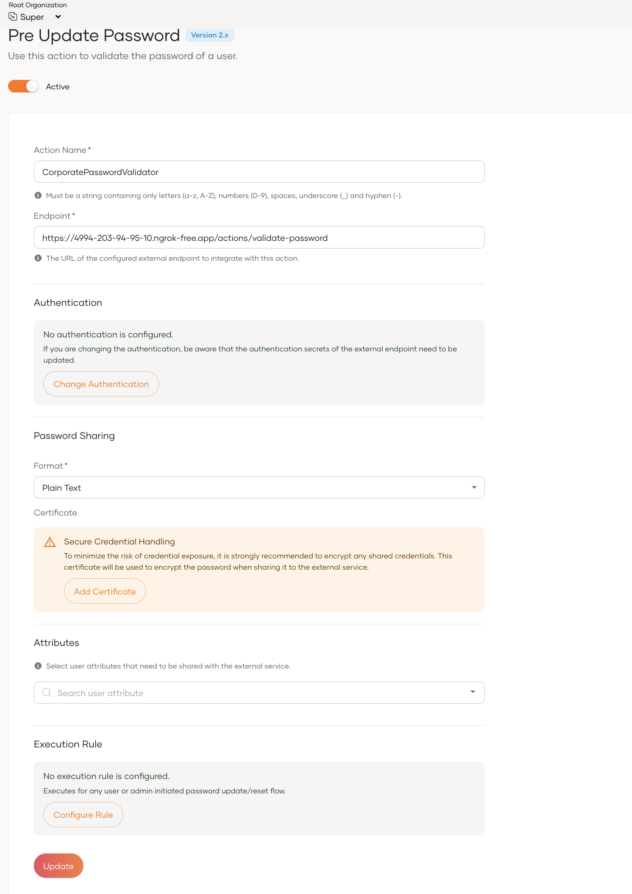

# 1. Overview & Learning Objectives

When a user sets or resets a password, WSO2 IS normally just checks
basic rules (length, complexity) on its own.

But sometimes you need to check the password against external sources,
or some hard rules. WSO2 IS Actions Framework lets you call an external
REST microservice before the password is hashed and saved —-that
microservice can talk to any third-party validation system.

## Learning Objectives:

- Understand the request/response execution pattern of Actions

- Implement a production-grade external validation service using Java
  Spring Boot to evaluate password complexity.

- Handle business rule failures and pass validation errors back to the
  WSO2 Identity Server orchestrator gracefully.

- Configure and register the Pre Update Password Action within the
  administrative console securely.

# 2. Infrastructure & Prerequisites

Ensure your current lab workstation meets the following baseline
environment configurations:

- WSO2 Identity Server 7.3.0.

- Java Development Kit (JDK 21 or 25) installed on your machine.

- An integrated development environment (IDE) for compiling your Java
  solution (e.g., IntelliJ IDEA).

- [<u>ngrok</u>](https://ngrok.com/) installed (to securely expose your
  local service to the internet so WSO2 IS can reach it).

# 3. Practical Task Formulation

## The Business Scenario:

Your organization wants to introduce a strict security policy requiring
that whenever a user's password changes, it must be evaluated for
strength against external operational criteria. For this exercise, your
validation hook must enforce the following business rules:

1.  The password must not contain any forbidden corporate tokens (e.g.,
    it must not explicitly match or contain the company's trademark word
    WSO2 or the user's own username).

2.  If the validation passes, the service sends a successful response
    allowing WSO2 Identity Server to complete the persistence flow.

3.  If validation fails, it must block the account action and report an
    explicit error description back to the client interface.

The Action framework must evaluate this across three discrete entry
points:

- Admin-initiated or application-driven user registrations.

- User self-registration endpoints.

- User-driven password updates (via My Account portal) or recovery
  flows.

# 4. Step-by-Step Implementation Guide

## Step 1: Analyze the Action Payload Specification

When a password update is triggered, WSO2 Identity Server stops
execution and fires a synchronous POST request to your webhook. The
payload includes correlation identifiers, the type of entry flow trigger
(RESET, UPDATE, or REGISTER), the target user's context, and the newly
requested cleartext password string.

A sample inbound payload parsed by your Action server looks like this:

{"flowId": "f7893510-2134-4bc5-a5b5-7df820a86279",

"requestId": "b69404cc-3f64-458d-a5b5-7df820a86279",

"actionType": "PRE_UPDATE_PASSWORD",

"event": {

"action": "UPDATE",

"tenant": {

"name": "carbon.super"

},

"user": {

"username": "alexsmith",

"userStore": "PRIMARY"

},

"passwordInfo": {

"password": "PasswordToValidate123!"

}

}

}

## 

## Step 2: Build the External Action REST Webhook in Java

You will implement a compact REST endpoint inside a Java Spring Boot
application to parse this event data, evaluate our custom business
logic, and respond with a structured outcome status (SUCCESS or FAILED).

#### 

#### 

#### 

#### 

#### 

#### 

#### 

#### Reference Code Snippet (Java Spring Boot Example):

import org.springframework.web.bind.annotation.\*;

import java.util.\*;

@RestController

@RequestMapping("/actions")

public class CRDBTrainingCustomPasswordActionController {

@PostMapping("/validate-password")

public Map\<String, Object\> validatePassword(@RequestBody Map\<String,
Object\> requestPayload) {

Map\<String, Object\> event = (Map\<String, Object\>)
requestPayload.get("event");

if (event == null) {

response.put("actionStatus", "ERROR");

return response;

}

Map\<String, Object\> userContext = (Map\<String, Object\>)
event.get("user");

if (userContext == null \|\|
!userContext.containsKey("updatingCredential")) {

response.put("actionStatus", "ERROR");

return response;

}

Map\<String, Object\> updatingCredential = (Map\<String, Object\>)
userContext.get("updatingCredential");

// You can write your logic here

}

}

### 

### Step 3: Map Public Routing via ngrok

Execute your Spring Boot application locally on port 8080. Next, expose
this local container interface to the public web registry via ngrok:

ngrok http 8080



Capture the target HTTPS forwarding address generated by the tunnel
(e.g., https://a1b2-c3d4.ngrok-free.app). Your live public Webhook
endpoint path will be:

https://a1b2-c3d4-e5f6.ngrok-free.app/api/webhooks/login-events

## Step 4: Register the Action in WSO2 Identity Server

1.  Boot up your WSO2 Identity Server engine and log into the Console UI

2.  From the main side-navigation panels, go to Extensions and select
    Actions under the API-based extension groups.

3.  Click on the Pre Update Password extension.

>  src="images/image2.png"
> style="width:4.67708in;height:5.01042in" />

4.  Fill in the primary metadata settings:

    - Action Name: CorporatePasswordValidator

    - Endpoint URL:
      http://\<your-workstation-ip\>:8080/actions/validate-password
      (Ensure the action endpoint is accessible over the internet. If
      you don't have a endpoint accessible over internet, you can use
      [<u>ngrok</u>](https://ngrok.com/), and expose your localhost
      domain)

5.  Configure your desired Authentication Type to protect your webhook
    endpoint from unauthenticated traffic.

6.  Click **Save and Enable it**.

## 

## Step 5: Try It Out & Verify Compliance

#### 

#### Case A: Test a Successful Password Update Flow

1.  Open the WSO2 User Self-Service Portal (My Account)

>  src="images/image1.png"
> style="width:6.5in;height:3.625in" />

2.  Check your Java Spring Boot console log to confirm that the server
    intercepted the flow, evaluated the payload, and returned a status
    of SUCCESS or FAILED.

# 5. Check Your Understanding & Troubleshooting Questions

Review these core architectural compliance questions to ensure
production readiness:

1.  In-Flight Failures & Availability: If the external Java Spring Boot
    service encounters a critical network exception or network timeout,
    how should WSO2 Identity Server behave? Is the core password update
    flow configured to fail-open or fail-closed by default?

2.  Data Minimization: Why are cleartext passwords transmitted in the
    event payload to an external hook rather than pre-hashed digests?
    What transport protections are strictly mandatory to ensure security
    over this trust boundary?

3.  Flow Differentiation: How does the payload configuration schema help
    your microservice distinguish between a user updating their password
    via self-service vs. an administrator initializing an account
    profile during creation?
