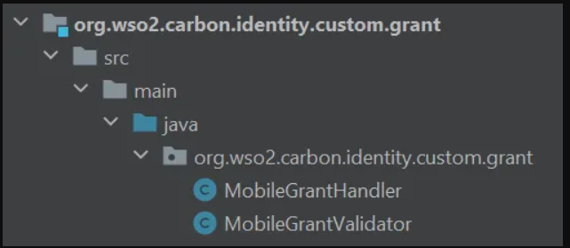

# Introduction

OAuth 2.0 authorization servers provide support for four main grant
types according to the OAuth 2.0 specification. It also has the
flexibility to support any custom grant types. To implement a custom
grant type, you need to write a handler and a validator for your grant
type.

#### Grant Type Handler

Specifies how the validation must be done and how the token should be
issued. This can be done in two ways. Either you can implement the
“AuthorizationGrantHandler” interface or you can extend the
“AbstractAuthorizationGrantHandler” class.

#### Grant Type Validator

Verifies and validates the token request and checks whether all the
required parameters are sent with the request. This can be implemented
by extending the “AbstarctValidator” class.

# Scenario

In this exercise, we are implementing a simple custom grant type called
“Mobile Grant”. You will pass a mobile number to the OAuth2 “token”
endpoint in exchange for an access token.

# Write the Custom Grant Handler

# Follow the steps given below.

1.  Create a maven project and in the source folder (a folder named
    *Java*), create a package (org.wso2.carbon.identity.custom.grant)
    for the new grant type. Then create two java classes for the
    validator and the handler.\
    \
    

2.  In the handler class extend the AbstractAuthorizationGrantHandler
    class.\
    \
    Then override the validateGrant method and implement the custom
    logic as follows:

<table style="width:92%;">
<colgroup>
<col style="width: 92%" />
</colgroup>
<thead>
<tr>
<th>
public class MobileGrant extends
AbstractAuthorizationGrantHandler {

private static Log log = LogFactory.getLog(MobileGrant.class);

public static final String MOBILE_GRANT_PARAM = "mobileNumber";

@Override

public boolean validateGrant(OAuthTokenReqMessageContext

oAuthTokenReqMessageContext) throws IdentityOAuth2Exception {

log.info("Mobile Grant handler is hit");

boolean authStatus = false;

// extract request parameters

RequestParameter[] parameters = oAuthTokenReqMessageContext

.getOauth2AccessTokenReqDTO().getRequestParameters();

String mobileNumber = null;

// find out mobile number

for (RequestParameter parameter : parameters) {

if (MOBILE_GRANT_PARAM.equals(parameter.getKey())) {

if (parameter.getValue() != null &amp;&amp;
parameter.getValue().length &gt; 0) {

mobileNumber = parameter.getValue()[0];

}

}

}

if (mobileNumber != null) {

//validate mobile number

authStatus = isValidMobileNumber(mobileNumber);

if (authStatus) {

// if valid set authorized mobile number as grant user

String tenantAwareUsername = MultitenantUtils

.getTenantAwareUsername(mobileNumber);

/*

Please use AuthenticatedUser

.createFederateAuthenticatedUserFromSubjectIdentifier()

if a federated user is involved with this custom grant.

*/

AuthenticatedUser mobileUser = AuthenticatedUser

.createLocalAuthenticatedUserFromSubjectIdentifier(

tenantAwareUsername);

// Set the federated IdP name if a federated user is involved

// with this custom grant.

//
mobileUser.setFederatedIdPName(FrameworkConstants.LOCAL_IDP_NAME);

oAuthTokenReqMessageContext.setAuthorizedUser(mobileUser);

oAuthTokenReqMessageContext.setScope(

oAuthTokenReqMessageContext.getOauth2AccessTokenReqDTO()

.getScope());

} else {

ResponseHeader responseHeader = new ResponseHeader();

responseHeader.setKey("SampleHeader-999");

responseHeader.setValue("Provided Mobile Number is Invalid.");

oAuthTokenReqMessageContext.addProperty("RESPONSE_HEADERS",

new ResponseHeader[]{responseHeader});

}

}

return authStatus;

}

@Override

public OAuth2AccessTokenRespDTO issue(OAuthTokenReqMessageContext
tokReqMsgCtx) throws IdentityOAuth2Exception {

OAuth2AccessTokenRespDTO tokenRespDTO = new
OAuth2AccessTokenRespDTO();

tokenRespDTO.setExpiresIn(tokReqMsgCtx.getAccessTokenIssuedTime() +
10000);

tokenRespDTO.setAccessToken(UUID.randomUUID().toString());

tokenRespDTO.setRefreshToken(UUID.randomUUID().toString());

tokenRespDTO.setTokenType("mobile");

return tokenRespDTO;

}

public boolean authorizeAccessDelegation(OAuthTokenReqMessageContext
tokReqMsgCtx)

throws IdentityOAuth2Exception {

// if we need to just ignore the end user's extended verification

return true;

}

public boolean validateScope(OAuthTokenReqMessageContext
tokReqMsgCtx)

throws IdentityOAuth2Exception {

// if we need to just ignore the scope verification

return true;

}

/**

* You need to implement how to validate the mobile number

*

* @param mobileNumber Mobile number of the user.

* @return true if the mobile number is valid, otherwise false.

*/

private boolean isValidMobileNumber(String mobileNumber) {

// Regular expression to match 10 digits, with optional country
code

String pattern = "^(\\+\\d{1,3})?\\d{10}$";

// Create a Pattern object

Pattern r = Pattern.compile(pattern);

// Create Matcher object

Matcher m = r.matcher(mobileNumber);

// Check if the pattern matches

return m.matches();

}

@Override

public boolean isOfTypeApplicationUser() throws
IdentityOAuth2Exception {

return true;

}

}
</th>
</tr>
</thead>
<tbody>
</tbody>
</table>

3.  In the validator class extend the AbstarctValidator class.\
    In the constructor, mention the mandatory parameters that should be
    in the request body.

<table style="width:92%;">
<colgroup>
<col style="width: 92%" />
</colgroup>
<thead>
<tr>
<th>
public class CRDBTrainingCustomMobileGrantValidator extends AbstractValidator {

public CRDBTrainingCustomMobileGrantValidator() {

requiredParams.add(CRDBTrainingCustomMobileGrantHandler.MOBILE_NUMBER);

}

}
</th>
</tr>
</thead>
<tbody>
</tbody>
</table>

# Prerequisites

1.  A [<u>WSO2 Identity Server</u>](https://wso2.com/identity-server/)
    setup.

- Please verify that all the [<u>system
  requirements</u>](https://is.docs.wso2.com/en/latest/deploy/environment-compatibility/)
  are satisfied.

2.  An Application registered in Identity Server.

3.  An application deployed in Tomcat server.

> Ex:
> [<u>pickup-dispatch</u>](https://github.com/wso2/samples-is/releases/download/v4.6.3/pickup-dispatch.war)
> application

# Set up

You can use the sample custom grant handler implementation from
[<u>here</u>](https://github.com/wso2/samples-is/tree/v4.6.0/oauth2/custom-grant).

1.  Navigate to the \<SAMPLE_IS\>/oauth2/custom-grant directory and run
    the following command:

| mvn clean install |
|-------------------|

2.  Copy the generated jar file in the target folder into
    \<IS_HOME\>/repository/components/lib/ folder.

3.  To register the custom grant type, configure the
    \<IS_HOME\>/repository/conf/deployment.toml file by adding a new
    entry, as shown below.

<table style="width:92%;">
<colgroup>
<col style="width: 92%" />
</colgroup>
<thead>
<tr>
<th style="text-align: left;">
[[oauth.custom_grant_type]]

name="mobile"

grant_handler="org.wso2.sample.identity.oauth2.grant.mobile.MobileGrant"

grant_validator="org.wso2.sample.identity.oauth2.grant.mobile.CRDBTrainingCustomMobileGrantValidator"

[oauth.custom_grant_type.properties]

IdTokenAllowed=true

PublicClientAllowed=true
</th>
</tr>
</thead>
<tbody>
</tbody>
</table>

4.  Restart the server.

5.  View your created application tab and goto the Protocol tab.

6.  Select the custom grant type **mobile** from the **Allowed Grant
    Types** list and click **Update**.

>  src="images/image4.png"
> style="width:6.5in;height:3.69444in" />

7.  Create a user and add a valid value for the **Mobile** field.

\
=

# Try it out

Follow the steps given below.

1.  Use the following request for mobile grant token generation.

<table style="width:92%;">
<colgroup>
<col style="width: 92%" />
</colgroup>
<thead>
<tr>
<th><blockquote>

curl --user &lt;CLIENT_KEY&gt;:&lt;CLIENT_SECRET&gt; -k -d
"grant_type=mobile&amp;mobileNumber=&lt;MOBILE_NUMBER&gt;" -H
"Content-Type: application/x-www-form-urlencoded"
https://localhost:9443/oauth2/token

</blockquote></th>
</tr>
</thead>
<tbody>
</tbody>
</table>

2.  You should get a response as below.

>  src="images/image5.png"
> style="width:4.0625in;height:1.01563in" />
